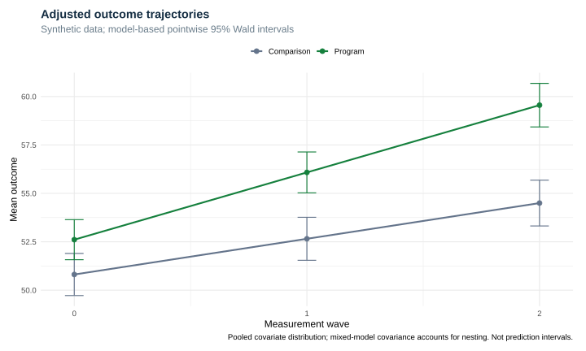
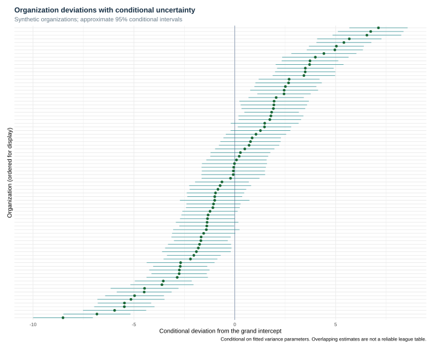
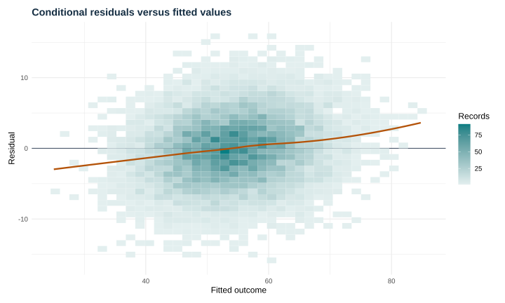

# Executed multilevel outcomes report

## Question and design

How does the program-associated trajectory differ across three waves when people are nested in organizations? The synthetic model contains organization random intercepts/slopes and person random intercepts.

## Adjusted trajectories

Means average the linear fixed-effects model over pooled covariates. Intervals use the mixed-model fixed-effect covariance; they are pointwise Wald intervals, not individual prediction intervals or simultaneous bands.

## Fixed effects

| term | estimate | std.error | statistic | conf.low | conf.high |
| --- | --- | --- | --- | --- | --- |
| (Intercept) | 51.070 | 0.557 | 91.742 | 49.979 | 52.161 |
| time | 1.844 | 0.123 | 15.041 | 1.604 | 2.085 |
| program | 1.799 | 0.766 | 2.349 | 0.298 | 3.300 |
| baseline_centered | 0.583 | 0.009 | 66.959 | 0.566 | 0.600 |
| ses_z | 1.575 | 0.079 | 19.947 | 1.420 | 1.730 |
| multilingual | -1.299 | 0.188 | -6.905 | -1.668 | -0.931 |
| time:program | 1.629 | 0.169 | 9.614 | 1.297 | 1.962 |

## Variance decomposition (null model)

| level | variance | share_of_total |
| --- | --- | --- |
| Person | 42.861 | 0.478 |
| Organization | 15.072 | 0.168 |
| Observation | 31.683 | 0.354 |

## Conditional organization effects

## Diagnostics and limits

The model is checked for convergence, singularity, finite uncertainty, and recovery of the known 1.55-point program-by-wave interaction. The stored conditional-versus-growth comparison changes both fixed and random structure: its likelihood-ratio p-value is exploratory, not an isolated test of the interaction or a boundary-corrected random-slope test.

These synthetic results are not a causal program evaluation. Conditional random-effect intervals hold estimated variance parameters fixed and should not be read as definitive rankings.

## Reproduction

This report and its figures are generated by the repository scripts from deterministic synthetic data.
See the repository README for commands and the versioned environment.

[Runtime session and package versions](session-info.txt)
